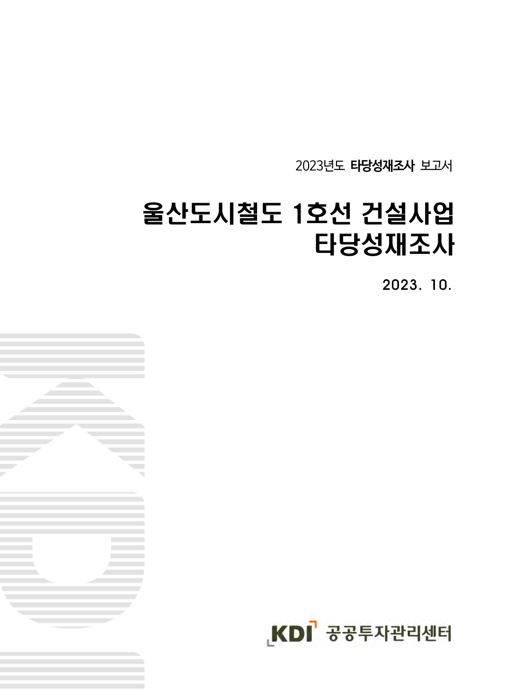
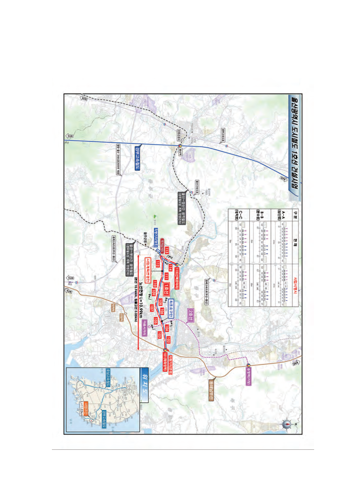
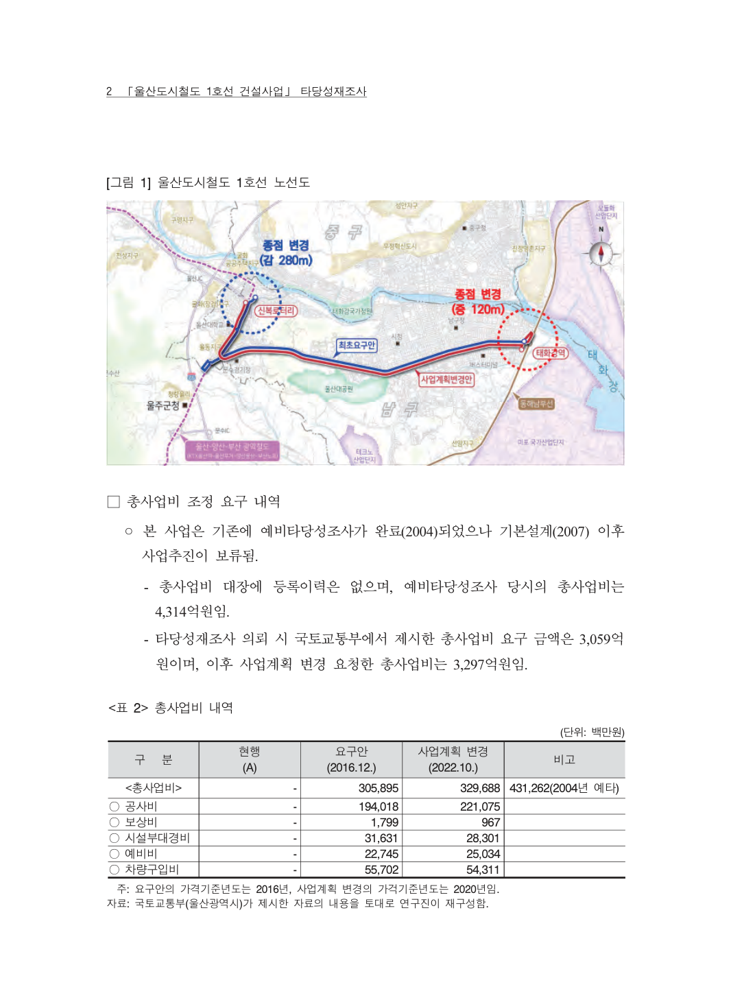
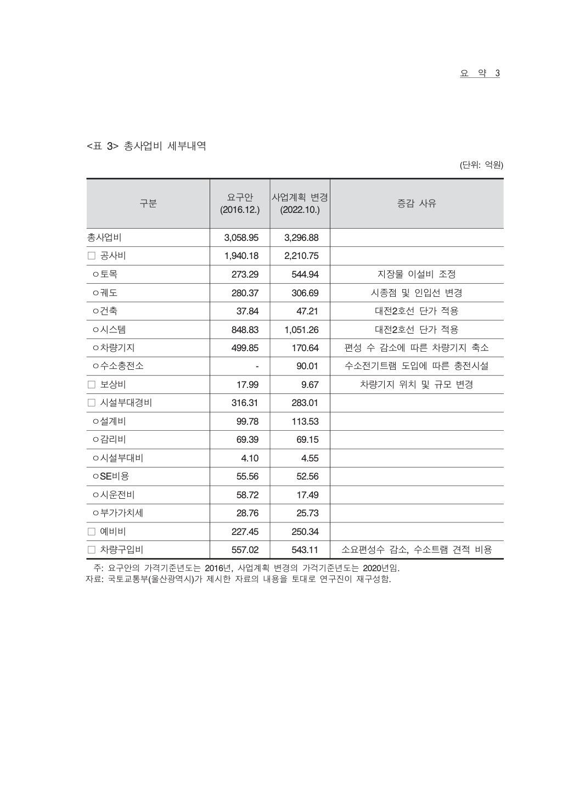
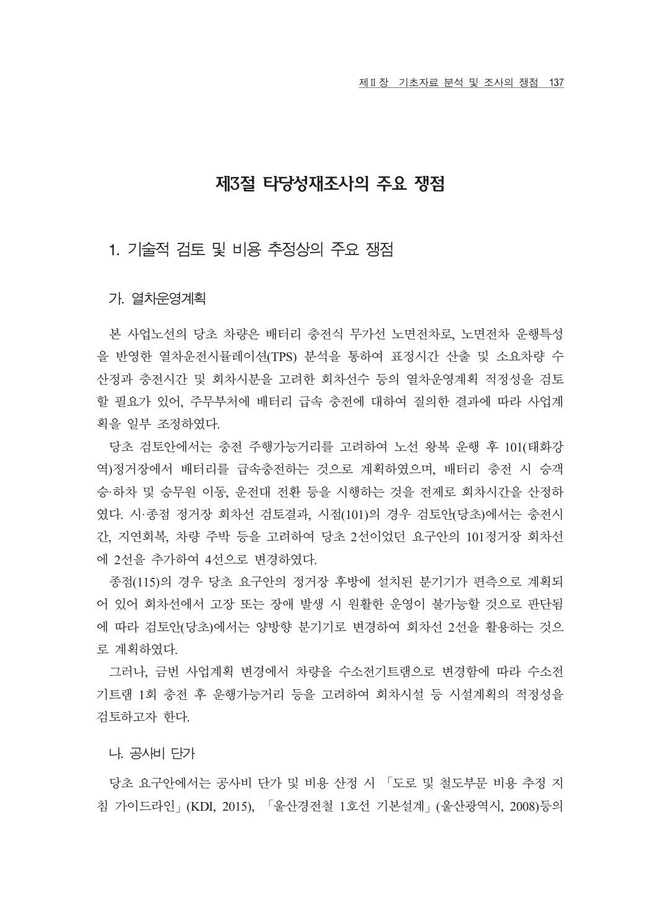
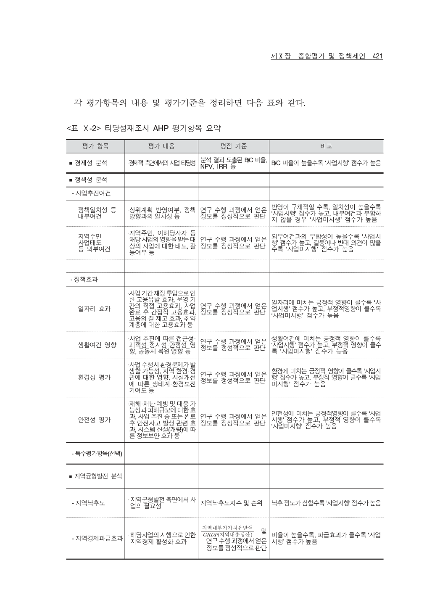
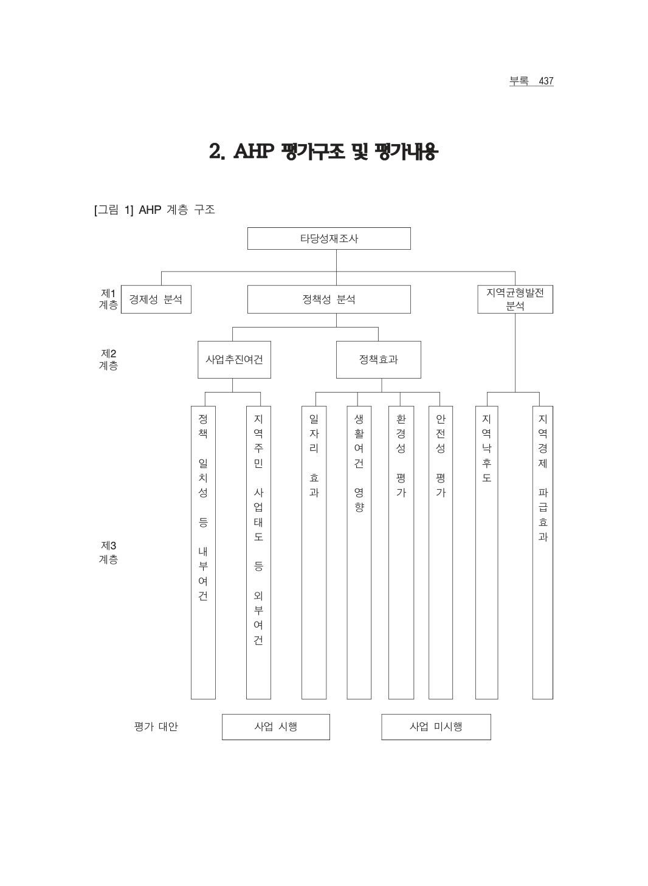

# 20231023-울산도시철도1호선-타당성재조사
## KDI 공공투자관리센터 「울산도시철도 1호선 건설사업 타당성재조사」 분석용 재구성본

> 작성 기준  
> 이 문서는 원본 PDF를 기계적으로 전부 Markdown으로 변환한 것이 아니다. 원본은 468쪽 이상의 기술보고서이며, 표·지도·도면·비용표·AHP 평가표가 많고 일부 텍스트 추출이 깨진다. 따라서 본 파일은 **본문 논리와 핵심 수치·쟁점을 Markdown으로 재구성**하고, **의미가 손상되기 쉬운 노선도·원표·AHP 관련 페이지는 이미지로 보존**하는 하이브리드 방식으로 작성했다.  
>  
> 원본 PDF와 함께 보관할 것을 전제로 한다. 이 MD 파일은 정책검토·쟁점정리·Obsidian 저장용 보조문서다.

---

## 0. 문서 기본정보

| 항목 | 내용 |
|---|---|
| 원문 제목 | 울산도시철도 1호선 건설사업 타당성재조사 |
| 작성 시점 | 2023년 10월 |
| 수행기관 | KDI 공공투자관리센터 |
| 문서 성격 | 재정사업 타당성재조사 보고서 |
| 대상 사업 | 울산도시철도 1호선 건설사업 |
| 주요 검토축 | 사업계획, 비용, 수요, 편익, 경제성, 정책성, 지역균형발전, AHP 종합평가 |
| 본 MD의 목적 | 원본 보고서의 핵심 논리·수치·쟁점을 정책검토용으로 재구성 |

---

## 1. 원문 변환 방식에 대한 판단

이 보고서는 일반 문서형 PDF가 아니라 기술보고서형 PDF다. 따라서 단순 텍스트 변환만으로는 문서 가치가 크게 떨어진다.

### 1-1. 자동 변환의 문제

| 문제 | 설명 |
|---|---|
| 한글 인코딩 깨짐 | 원문 일부가 ``, ``, `` 등으로 추출된다. |
| 표 구조 손상 | 비용표, 수요표, AHP 표는 열이 많아 Markdown 자동 변환 시 줄바꿈·열 정렬이 무너진다. |
| 지도·노선도 손실 | 노선도, 정거장 위치도, 사업 위치도는 텍스트로 바꾸면 정보가 사라진다. |
| 그래프 의미 손상 | 수요·비용·편익 추정 과정의 그래프는 원이미지 보존이 필요하다. |
| 정책검토 부적합 | 원문 전체를 깨진 텍스트로 변환하면 검색은 가능해도 정책판단 자료로 쓰기 어렵다. |

### 1-2. 본 파일의 처리 원칙

1. 핵심 구조와 수치는 Markdown 표로 재작성한다.  
2. 원본의 복잡한 표와 지도는 이미지로 함께 보존한다.  
3. 텍스트가 깨진 부분은 문맥상 확실한 범위에서만 보정한다.  
4. 불확실한 항목은 “확인 필요”로 남긴다.  
5. 향후 사업 중단·재검토 논리로 활용할 수 있도록 쟁점 중심으로 재배열한다.

---

## 2. 사업 개요

원문에서 확인되는 2022년 10월 기준 사업계획은 다음과 같이 정리된다.

| 항목 | 2016년 12월 기준 | 2022년 10월 기준 |
|---|---:|---:|
| 사업 구간 | 태화강역~신복로터리 일원으로 추정 | 태화강역~신복로터리 일원으로 추정 |
| 연장 | 11.63km | 10.99km |
| 정거장 수 | 15개 | 15개 |
| 총사업비 | 약 3,059억 원 | 약 3,297억 원 |
| 국비지원 비율 | 60%로 제시 | 60%로 제시 |
| 사업기간 | 2021~2027년으로 제시 | 2021~2027년으로 제시 |

> 주의: 원문 PDF의 일부 한글 텍스트가 깨져 있어 구간명은 원본 이미지와 별도 원문 확인이 필요하다. 다만 연장, 정거장 수, 총사업비, 국비지원 비율 등 핵심 수치는 추출 가능하다.

---

## 3. 비용 구조

### 3-1. 총사업비 변화

원문상 총사업비는 2016년 기준 약 3,058.95억 원에서 2022년 기준 약 3,296.88억 원으로 증가한 것으로 확인된다.

| 구분 | 2016년 기준 | 2022년 기준 | 증감 |
|---|---:|---:|---:|
| 총사업비 | 3,058.95억 원 | 3,296.88억 원 | +237.93억 원 |
| 공사비 | 1,940.18억 원 | 2,210.75억 원 | +270.57억 원 |
| 용지보상비 등 | 17.99억 원 | 9.67억 원 | -8.32억 원 |
| 시설부대경비 등 | 316.31억 원 | 283.01억 원 | -33.30억 원 |
| 예비비 등 | 227.45억 원 | 250.34억 원 | +22.89억 원 |
| 기타 비용 | 557.02억 원 | 543.11억 원 | -13.91억 원 |

### 3-2. 정책검토상 의미

총사업비 증가는 단순 물가상승 문제가 아니다. 도시철도 사업은 기본설계·실시설계·공사 과정에서 다음 요인에 따라 사업비가 추가로 늘 수 있다.

| 사업비 상승 요인 | 울산 1호선 관련 검토 포인트 |
|---|---|
| 설계 구체화 | 기본계획 단계의 추정이 실시설계에서 달라질 수 있음 |
| 교통처리비 | 문수로·공업탑 등 혼잡구간 공사 중 교통대책 비용 |
| 차량·전기·신호 | 트램 차량, 전력, 신호, 관제 시스템 비용 |
| 정거장·환승시설 | 정거장 편의시설, 안전시설, 보행 접근시설 |
| 민원·보상 | 공사 중 영업손실·접근성 저하·도로점용 관련 민원 |
| 물가상승 | 2023년 이후 건설공사비 상승 반영 필요 |
| 운영비 | 건설비와 별도로 개통 후 매년 반복되는 재정부담 |

---

## 4. 사업 추진 연혁

원문에는 과거 도시철도 기본계획, 예비타당성조사, 국토교통부 승인·고시, 타당성재조사 관련 절차가 연혁형으로 제시되어 있다. 자동 추출 텍스트는 일부 깨지지만, 큰 흐름은 다음과 같다.

| 시기 | 내용 |
|---|---|
| 2004년 12월 | 도시철도 관련 초기 검토. 당시 B/C 1.21, AHP 0.696으로 제시된 기록이 있음 |
| 2005년 11월 | 도시교통 관련 계획 수립 또는 용역 진행으로 추정 |
| 2008년 10월 | 울산 도시철도 1호선 관련 기본계획 또는 승인 절차 진행 |
| 2017년 4월~2020년 9월 | 도시철도망 구축계획 관련 절차 진행 |
| 2020년 8월~12월 | 노선·도시철도망 관련 승인·고시 절차 진행 |
| 2021년 1월 이후 | 도시철도 1호선 관련 후속 절차 진행 |
| 2023년 10월 | KDI 공공투자관리센터 타당성재조사 보고서 작성 |

---

## 5. 대안 검토 결과

원문에는 여러 대안에 대한 연장, 수요, 총사업비, B/C, AHP, 순위가 비교되어 있다. 자동 추출 가능한 핵심표는 다음과 같다.

| 대안 | 연장 | 총사업비 | B/C | AHP | 순위 |
|---|---:|---:|---:|---:|---:|
| 대안 1 | 11.63km | 3,059억 원 | 1.06 | 0.59 | 1 |
| 대안 2 | 13.69km | 3,940억 원 | 0.95 | 0.51 | 2 |
| 대안 3 | 16.99km | 4,085억 원 | 0.74 | 0.40 | 3 |
| 대안 4 | 5.94km | 2,232억 원 | 0.70 | 0.36 | 4 |

### 5-1. 해석

- 대안 1은 B/C가 1을 넘고 AHP도 0.5를 초과해 가장 유리한 대안으로 평가된 것으로 보인다.
- 대안 2는 AHP가 0.51로 기준선을 근소하게 넘지만 B/C는 0.95로 1에 못 미친다.
- 대안 3과 대안 4는 경제성·종합평가 모두 낮게 나타난다.
- 이 표는 “어떤 대안이 더 낫나”를 보여주는 표이지, 현재 추진 중인 최종 사업계획의 공사비·운영비·공사 중 교통혼잡까지 충분히 설명하는 것은 아니다.

---

## 6. 수요 추정 쟁점

타당성재조사 보고서의 핵심은 수요 추정이다. 트램은 도로 위를 달리기 때문에 지하철보다 건설비는 낮을 수 있지만, 수요가 충분하지 않으면 운영적자가 장기간 발생한다.

### 6-1. 검토해야 할 수요 쟁점

| 쟁점 | 검토 질문 |
|---|---|
| 버스 이용자의 전환 | 기존 버스 승객이 얼마나 트램으로 옮겨갈 것인가 |
| 승용차 전환 | 승용차 이용자가 실제로 트램으로 바꿀 유인이 있는가 |
| 도보 접근성 | 정거장까지 걸어가는 시간이 시민에게 수용 가능한가 |
| 환승 저항 | 버스-트램-버스 환승이 불편해져 오히려 대중교통 이용이 줄지 않는가 |
| 도어투도어 한계 | 울산처럼 자가용 의존도가 높은 도시에서 트램이 생활 동선에 맞는가 |
| 주거·상업 개발 | 노선 주변 신축 주거지와 상업지 개발이 수요를 얼마나 늘릴 것인가 |
| 인구 감소 | 장기 인구 감소와 고령화가 수요 추정에 얼마나 반영되었는가 |

### 6-2. 정책적 유의점

수요 추정이 과대평가되면 다음 문제가 생긴다.

1. B/C가 실제보다 높게 나온다.  
2. AHP 평가에서 정책성 논리가 과도하게 강화될 수 있다.  
3. 개통 후 운영수입이 부족해 매년 재정지원이 필요해진다.  
4. 버스 보조금과 도시철도 운영보조금이 동시에 증가할 수 있다.  
5. 도로 혼잡을 줄이려던 사업이 오히려 도로 용량을 줄이는 결과를 낳을 수 있다.

---

## 7. 편익 추정 쟁점

도시철도 타당성 분석에서 편익은 보통 통행시간 절감, 차량운행비 절감, 교통사고 감소, 환경비용 절감 등으로 구성된다. 그러나 트램은 도로 공간을 직접 점유하기 때문에 편익 산정에서 다음 사항을 별도로 보아야 한다.

| 편익 항목 | 일반적 의미 | 울산 1호선 검토 포인트 |
|---|---|---|
| 통행시간 절감 | 대중교통 이용자가 더 빨리 이동 | 트램 속도와 정차시간, 환승저항 반영 필요 |
| 차량운행비 절감 | 승용차 이용 감소에 따른 비용 절감 | 실제 승용차 전환율이 핵심 |
| 환경 편익 | 배출가스·온실가스 감소 | 전력 사용과 버스체계 재편 효과 동시 고려 |
| 사고 감소 | 교통사고 비용 감소 | 노면 트램과 도로교통 혼재에 따른 안전위험 검토 |
| 쾌적성·정시성 | 대중교통 서비스 질 개선 | 전용차로 확보 여부와 도로 혼잡 영향 고려 |

---

## 8. 경제성 분석: B/C의 의미

B/C는 Benefit-Cost ratio, 즉 편익/비용 비율이다. 1보다 크면 계산상 편익이 비용보다 크다는 뜻이다. 그러나 B/C는 다음 전제에 크게 좌우된다.

| 전제 | 영향 |
|---|---|
| 장래 수요 | 수요가 커질수록 편익이 커짐 |
| 통행시간 절감 | 절감시간이 크게 잡히면 편익 증가 |
| 공사비 | 공사비가 늘면 B/C 하락 |
| 운영비 | 운영비가 크면 순편익 악화 |
| 환승저항 | 환승 불편을 크게 보면 수요와 편익 감소 |
| 도로혼잡 | 공사 중·개통 후 도로용량 감소를 반영하면 편익 감소 가능 |

### 8-1. 이 보고서에서 정책적으로 봐야 할 점

대안검토 표에서 일부 대안은 B/C가 1 이상 또는 1에 근접한다. 그러나 사업 중단 또는 재검토 관점에서는 다음을 확인해야 한다.

1. 현재 최종 사업계획의 B/C가 어떤 수요·비용 전제에 근거하는가.  
2. 2023년 이후 건설비 상승이 반영되면 B/C가 얼마나 하락하는가.  
3. 공사 중 교통혼잡 비용이 충분히 반영되었는가.  
4. 개통 후 문수로·공업탑 일대 도로용량 감소가 편익을 갉아먹지 않는가.  
5. 버스노선 개편 실패 또는 환승저항 증가 시 수요가 얼마나 줄어드는가.  
6. 대전 트램, 위례 트램, 용인경전철 등 사례와 비교할 때 수요·비용 전제가 보수적인가.

---

## 9. AHP 평가의 의미

AHP는 Analytic Hierarchy Process, 즉 계층화 분석법이다. 경제성뿐 아니라 정책성, 지역균형발전, 사업추진상 위험 등을 종합해 사업 추진 여부를 판단하는 방식이다.

### 9-1. AHP를 볼 때 주의할 점

| 항목 | 설명 |
|---|---|
| 0.5 기준 | 일반적으로 AHP가 0.5 이상이면 사업 추진 쪽 판단이 우세한 것으로 본다. |
| 경제성 보완 | B/C가 낮아도 정책성·지역균형발전 점수가 높으면 종합평가가 통과될 수 있다. |
| 주관성 | 전문가 판단이 들어가므로 전제와 가중치가 중요하다. |
| 정치적 활용 위험 | 경제성이 낮은 사업을 정책성으로 밀어붙이는 수단이 될 수 있다. |
| 재검토 포인트 | 경제성, 정책성, 지역균형발전 각 항목의 세부 점수와 가중치를 확인해야 한다. |

---

## 10. 사업 재검토 관점의 핵심 쟁점

### 10-1. 사업비 증가 위험

원문 기준 총사업비는 2022년 기준 약 3,297억 원이다. 그러나 2023년 이후 건설공사비, 인건비, 자재비, 안전·교통처리 비용이 상승했다. 특히 도심부 노면공사는 공사 중 교통처리와 민원 대응 비용이 크게 늘 수 있다.

### 10-2. 운영적자 위험

트램은 개통 이후 매년 인건비, 차량 유지비, 전력비, 궤도·전차선·신호 유지비, 관제비, 안전관리비가 발생한다. 운임수입이 이를 감당하지 못하면 울산시 일반재정 또는 교통특별회계에서 지속적으로 보전해야 한다.

### 10-3. 버스체계와의 충돌

울산은 최근 시내버스 노선개편으로 큰 시민 불편을 겪었다. 트램이 들어오면 버스노선을 다시 조정해야 한다. 버스-트램 환승체계가 불편하면 오히려 대중교통 전체 신뢰가 떨어질 수 있다.

### 10-4. 문수로·공업탑 교통혼잡

트램 1호선 예정 구간은 이미 울산에서 혼잡도가 높은 축이다. 노면 트램은 도로 공간을 점유하므로 공사 중에는 차로 감소가 발생하고, 개통 후에도 승용차 흐름과 상충할 수 있다.

### 10-5. 시민 공론화 부족

도시철도는 단순 교통시설이 아니라 수십 년 동안 시민 이동 방식과 재정구조를 바꾸는 사업이다. 따라서 공사 착수 전 시민에게 사업비, 운영비, 교통혼잡, 버스노선 조정, 대안교통수단을 투명하게 설명해야 한다.

---

## 11. 중단 또는 재검토 논리로 활용할 수 있는 질문

| 구분 | 핵심 질문 |
|---|---|
| 비용 | 2023년 이후 물가와 공사비를 반영하면 총사업비는 얼마인가 |
| 운영 | 개통 후 연간 운영적자는 얼마로 추정되는가 |
| 교통 | 공사 중 문수로·공업탑·신복로터리 교통속도는 얼마나 떨어지는가 |
| 수요 | 승용차 이용자가 실제 트램으로 얼마나 전환되는가 |
| 환승 | 버스 이용자가 트램 환승을 받아들일 것인가 |
| 버스 | 트램과 중복되는 버스노선은 어떻게 조정할 것인가 |
| 대안 | BRT, 고급 BRT, 자율주행버스, 버스공영제와 비교했는가 |
| 재정 | 버스 보조금과 트램 운영보조금을 동시에 감당할 수 있는가 |
| 법·절차 | 총사업비 조정, 타당성재조사 추가 요청, 대광위 협의 등 절차적 선택지는 무엇인가 |
| 시민 | 시민 공론화 없이 착공하는 것이 정당한가 |

---

## 12. 후속 작업 제안

이 MD는 1차 하이브리드 재구성본이다. 실제 정책보고서로 활용하려면 다음 보완이 필요하다.

1. 원문에서 최종 B/C, AHP, 비용·편익 세부표를 추가 확인한다.  
2. 공사 중 교통혼잡 분석표와 도로속도 변화 자료를 별도로 추출한다.  
3. 운영비·운영수입·연간 재정지원 추정표를 별도 표로 재작성한다.  
4. 대전 트램, 위례 트램, 용인경전철, 김해경전철 등 비교사례를 붙인다.  
5. “사업 지속”, “사업 축소”, “BRT 전환”, “사업 중단”의 4개 시나리오를 만든다.  
6. 시민 설명용 5쪽 요약본과 시의회 보고용 쟁점표를 별도로 만든다.

---

## 부록 A. 원본 이미지 색인

| 이미지 | 내용 |
|---|---|
| p003_cover.png | 원문 표지 |
| p009_route_map.png | 노선도 및 정거장 위치 원문 이미지 |
| p032_project_plan_cost_summary.png | 사업계획 및 비용 요약 원문 이미지 |
| p033_cost_detail.png | 비용 세부표 원문 이미지 |
| p034_project_history.png | 추진연혁 원문 이미지 |
| p167_alternatives_summary.png | 대안 비교 및 B/C·AHP 요약 원문 이미지 |
| p220_construction_cost_detail.png | 공사비 세부 원문 이미지 |
| p451_ahp_explanation.png | AHP 설명 원문 이미지 |
| p467_appendix_ahp_structure.png | AHP 구조 부록 원문 이미지 |

---

## 부록 B. 원본 PDF 처리 메모

- 원본 PDF는 텍스트 인코딩이 일부 깨져 있어 전체 자동 변환에는 적합하지 않다.
- `노선도`, `비용표`, `AHP 표`, `대안 비교표`는 이미지로 보존하는 것이 안전하다.
- 본 MD의 표는 원문에서 추출 가능한 숫자를 바탕으로 사람이 읽기 쉽게 재작성한 것이다.
- 원문과 수치가 충돌할 경우 원본 PDF의 표와 KDI 최종보고서를 우선한다.
