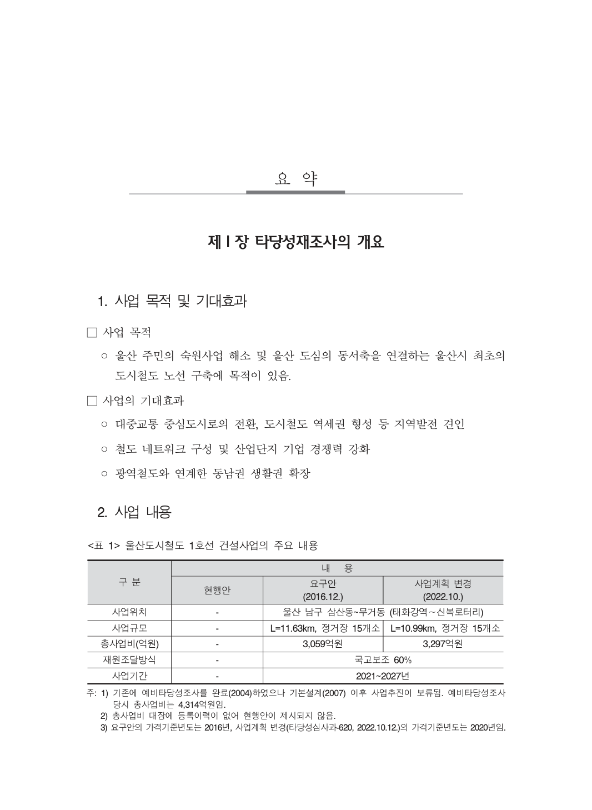
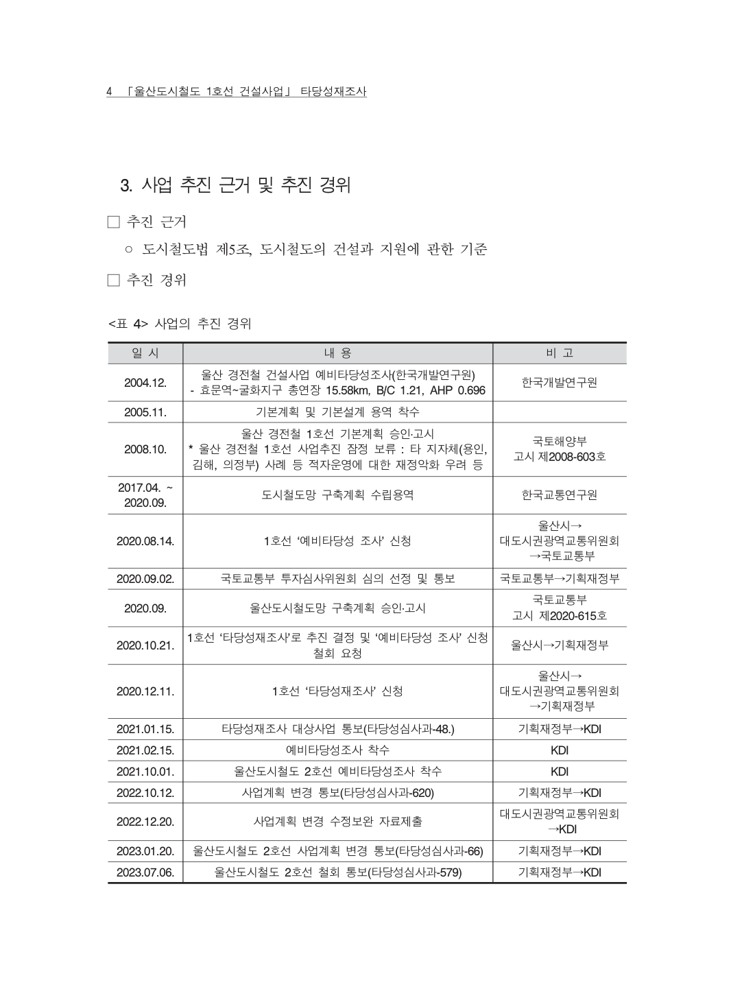
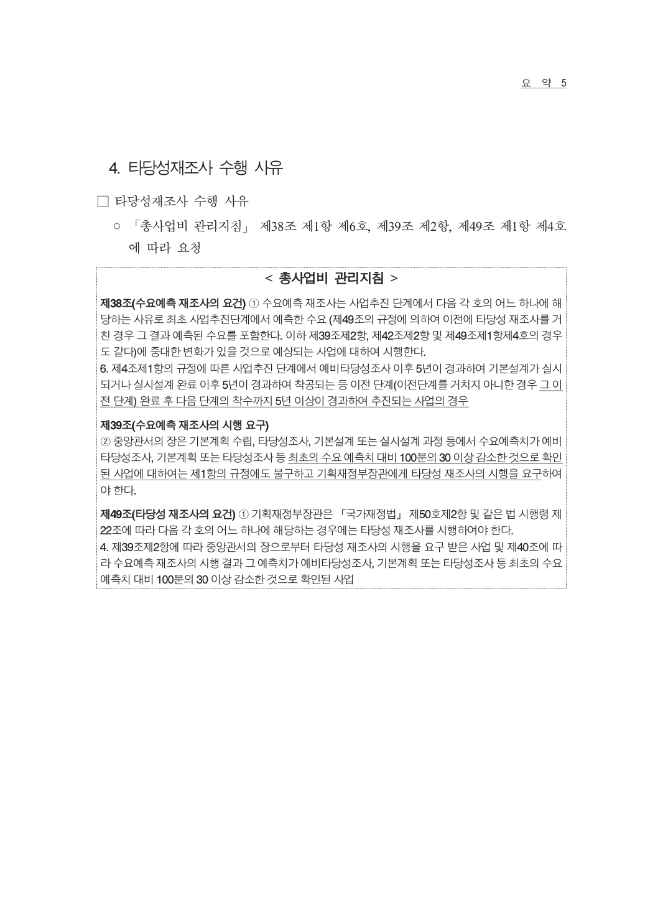
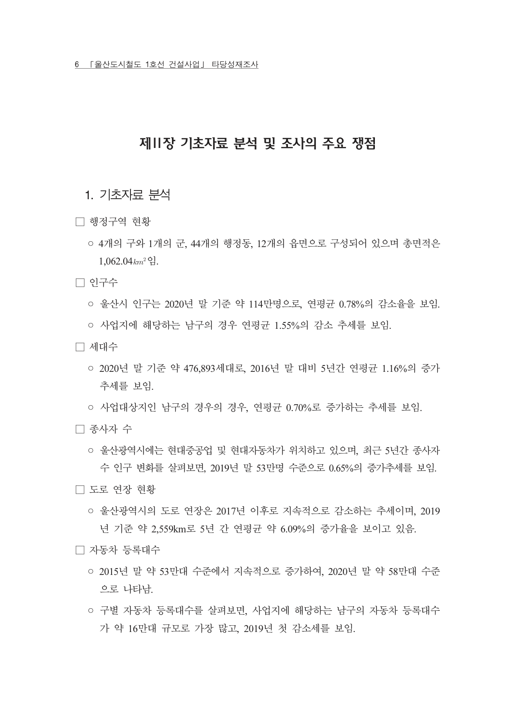
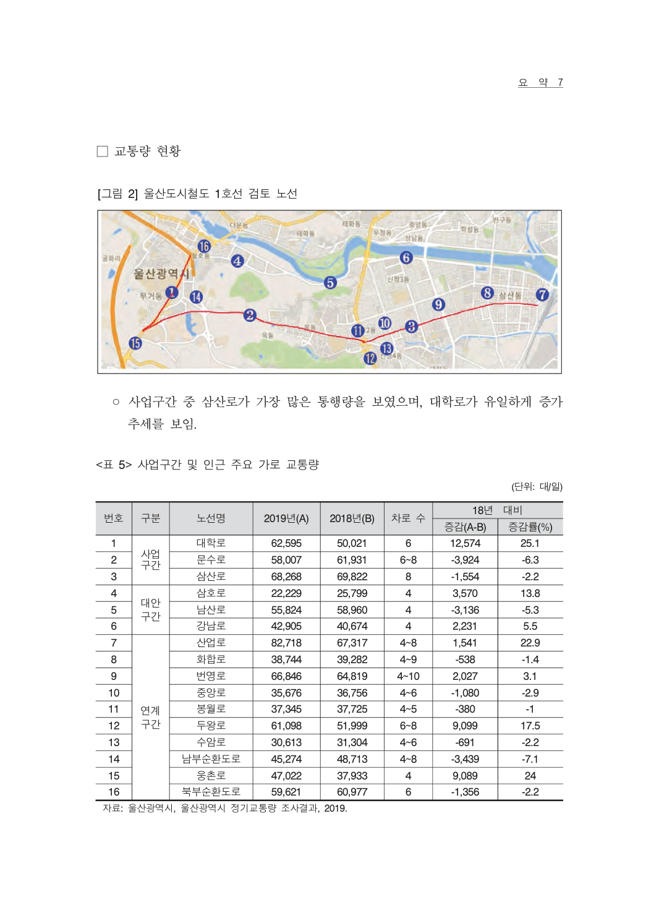
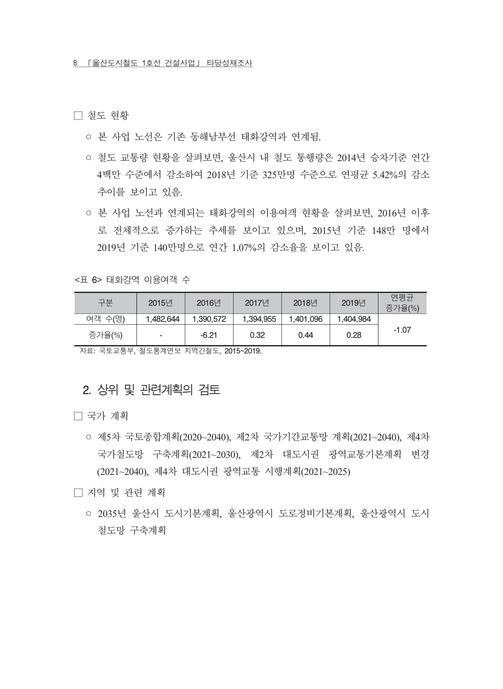
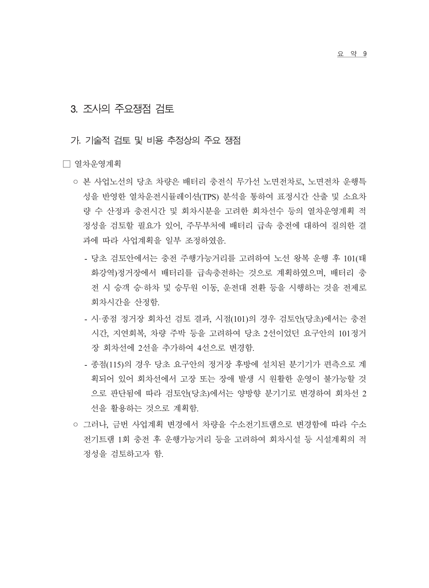
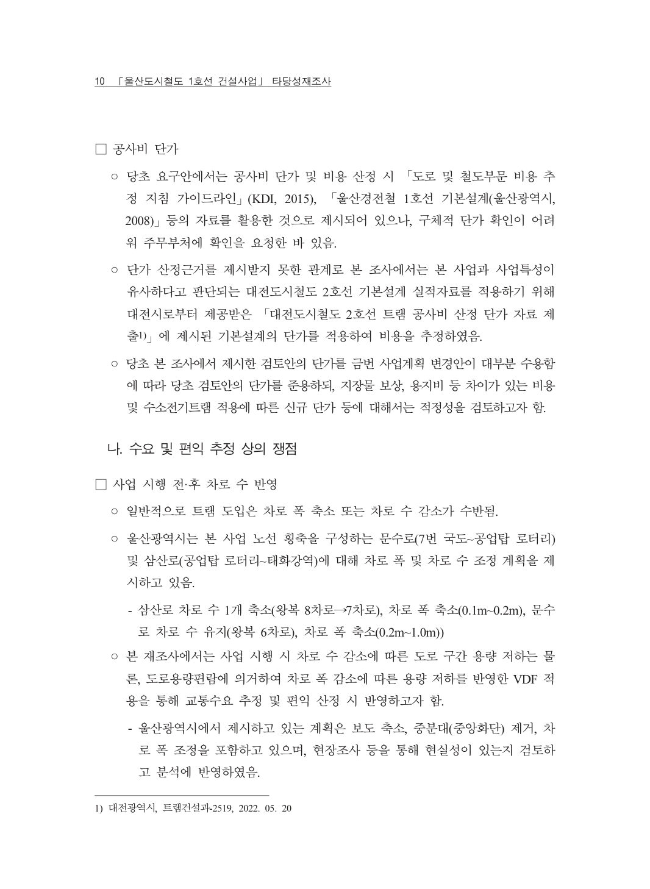
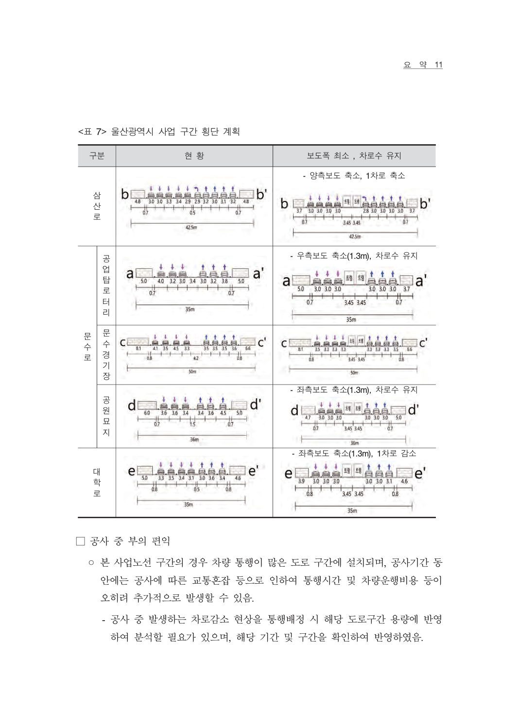
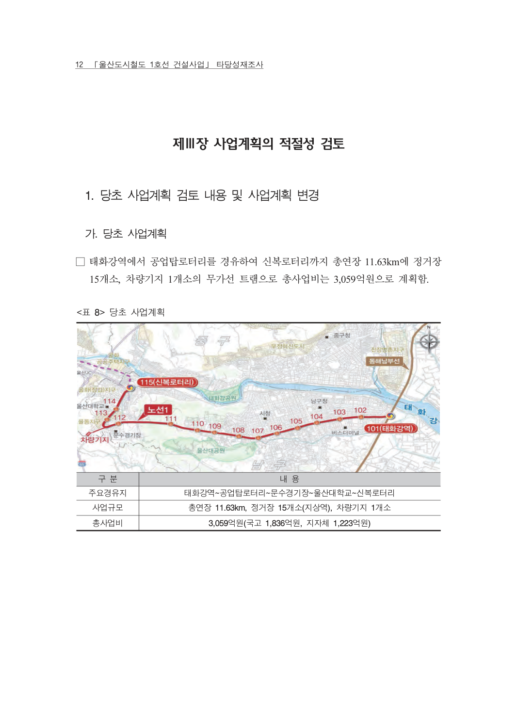

# 01. 문서개요 및 사업개요
## 울산도시철도 1호선 건설사업 타당성재조사 장별 재구성본

> 원문 위치  
> - 원본 PDF 표지: p.3  
> - 노선도 원문 이미지: p.9  
> - 사업 개요 및 사업계획 표: p.31~p.34  
> - 관련 법령·계획 검토 일부: p.35~p.42  
>
> 작성 방식  
> 원문 PDF의 텍스트 추출은 일부 한글 인코딩이 깨진다. 따라서 이 장에서는 핵심 본문과 수치를 Markdown으로 재작성하고, 원문 확인이 필요한 표·그림은 페이지 이미지로 보존한다.

---

## 1. 원문 문서의 성격

이 문서는 **「울산도시철도 1호선 건설사업 타당성재조사」** 보고서다. 표지 기준 작성 시점은 **2023년 10월**이며, 공공투자관리센터의 타당성재조사 형식으로 작성되어 있다.

타당성재조사는 이미 추진되었거나 추진 예정인 재정사업에 대해 사업비, 수요, 편익, 경제성, 정책성, 지역균형발전, AHP 종합평가 등을 다시 점검하는 절차다. 일반적인 홍보자료가 아니라, 국가재정사업의 계속 추진 여부와 사업계획 적정성을 검증하는 기술보고서다.

---

## 2. 노선도와 사업 위치

원문 앞부분에는 울산도시철도 1호선의 노선도와 정거장 위치가 지도 형태로 제시되어 있다. 이 정보는 텍스트로 변환하면 공간적 의미가 사라지므로 원문 이미지를 보존한다.

### 2-1. 노선도에서 확인해야 할 정책적 포인트

| 확인 항목 | 정책적 의미 |
|---|---|
| 태화강역 연계 | 광역철도·일반철도와의 환승 가능성, 동서축 연결성 |
| 공업탑·문수로 축 | 울산 도심 혼잡축을 통과하는 노면교통의 위험 |
| 신복로터리·울산대권 | 통학·통근 수요와 버스 환승수요 |
| 정거장 간격 | 도보 접근성과 표정속도의 균형 |
| 기존 버스노선과 중복 | 버스노선 개편 없이는 트램 수요 확보가 어려움 |
| 도로폭과 교차로 | 공사 중 교통처리와 개통 후 차로잠식 문제 |

---

## 3. 사업의 기본 개요

원문 p.31의 사업개요 표는 일부 글자가 깨지지만, 핵심 수치는 비교적 확인 가능하다. 사업은 2016년 12월 기준 계획과 2022년 10월 기준 계획을 비교하는 방식으로 제시되어 있다.

### 3-1. 사업계획 비교

| 항목 | 2016년 12월 기준 | 2022년 10월 기준 | 해석 |
|---|---:|---:|---|
| 사업구간 | 태화강역~신복로터리 일원으로 해석 | 태화강역~신복로터리 일원으로 해석 | 구간명은 원문 이미지 대조 필요 |
| 연장 | 11.63km | 10.99km | 연장은 축소 |
| 정거장 수 | 15개 | 15개 | 정거장 수는 유지 |
| 총사업비 | 약 3,059억 원 | 약 3,297억 원 | 약 238억 원 증가 |
| 국비지원 비율 | 60% | 60% | 지방비 부담도 상당 |
| 사업기간 | 2021~2027년 | 2021~2027년 | 원문 기준 계획기간 |

### 3-2. 핵심 해석

2022년 10월 기준 계획은 2016년 기준보다 노선 연장은 줄었으나 총사업비는 증가했다. 이는 단순히 연장만으로 사업비를 판단할 수 없다는 뜻이다. 정거장, 차량시스템, 전기·신호·통신, 교통처리, 설계변경, 물가상승 등이 사업비에 영향을 준다.

사업 중단 또는 재검토 관점에서는 다음 질문이 중요하다.

1. 2022년 10월 기준 총사업비 3,297억 원은 2023년 이후 건설비 상승을 충분히 반영했는가.  
2. 실시설계와 총사업비 협의 과정에서 추가 증액 가능성은 어느 정도인가.  
3. 연장이 줄었는데도 사업비가 늘어난 항목은 무엇인가.  
4. 국비 60%가 확보되더라도 지방비와 운영비 부담을 울산시가 감당할 수 있는가.  
5. 건설비와 별개로 개통 후 매년 발생하는 운영적자 추정이 시민에게 충분히 설명되었는가.

---

## 4. 총사업비 구조

원문 p.32~p.33에는 총사업비 및 세부 비용 비교표가 제시되어 있다. 핵심 수치는 다음과 같이 정리된다.

### 4-1. 총사업비 비교

| 구분 | 2016년 12월 기준 | 2022년 10월 기준 | 증감 |
|---|---:|---:|---:|
| 총사업비 | 3,058.95억 원 | 3,296.88억 원 | +237.93억 원 |
| 공사비 | 1,940.18억 원 | 2,210.75억 원 | +270.57억 원 |
| 용지보상비 | 17.99억 원 | 9.67억 원 | -8.32억 원 |
| 시설부대경비 | 316.31억 원 | 283.01억 원 | -33.30억 원 |
| 예비비 | 227.45억 원 | 250.34억 원 | +22.89억 원 |
| 기타 비용 | 557.02억 원 | 543.11억 원 | -13.91억 원 |

### 4-2. 세부 공사비 변화

원문 p.33의 세부표는 공종별 세부 항목이 포함되어 있으나, 일부 항목명은 인코딩 문제로 불명확하다. 그래도 다음 구조는 읽을 수 있다.

| 대분류 | 2016년 기준 | 2022년 기준 | 정책적 해석 |
|---|---:|---:|---|
| 공사비 | 1,940.18억 원 | 2,210.75억 원 | 전체 증가의 핵심 항목 |
| 세부 항목 1 | 273.29억 원 | 544.94억 원 | 큰 폭 증가, 원문 항목명 대조 필요 |
| 세부 항목 2 | 280.37억 원 | 306.69억 원 | 소폭 증가 |
| 세부 항목 3 | 37.84억 원 | 47.21억 원 | 증가 |
| 세부 항목 4 | 848.83억 원 | 1,051.26억 원 | 큰 폭 증가 |
| 세부 항목 5 | 499.85억 원 | 170.64억 원 | 큰 폭 감소 |
| 신규 또는 조정 항목 | - | 90.01억 원 | 2022년 기준 새로 반영된 항목으로 보임 |

### 4-3. 정책적 해석

총사업비 증가는 다음 점에서 중요하다.

- 경제성 분석의 비용분모를 키워 B/C를 낮추는 요인이 된다.
- 설계가 구체화될수록 추가비용이 드러날 수 있다.
- 도심부 노면공사는 공사 중 교통처리, 민원, 야간공사, 안전관리비가 증가할 수 있다.
- 문수로·공업탑 등 혼잡축을 통과하는 경우 단순 공종비 외에 사회적 비용이 커질 수 있다.
- 총사업비가 늘면 국비가 60%라고 해도 지방비 40% 부담도 함께 커진다.

---

## 5. 사업 추진 연혁

원문 p.34에는 사업 추진 경위가 연혁형으로 제시되어 있다.

### 5-1. 연혁 재구성

| 시기 | 원문상 내용 | 해석 |
|---|---|---|
| 2004.12 | 도시철도 관련 초기 검토, B/C 1.21, AHP 0.696으로 제시 | 초기 도시철도 검토에서 긍정 평가가 있었던 것으로 보임 |
| 2005.11 | 후속 계획 또는 용역 | 세부 명칭은 원문 대조 필요 |
| 2008.10 | 도시철도 관련 기본계획 또는 고시 | 울산 도시철도계획의 초기 제도화 단계 |
| 2017.04~2020.09 | 도시철도망 구축계획 관련 절차 | 중장기 도시철도망 재검토 기간 |
| 2020.08.14 | 노선 또는 도시철도망 관련 승인 신청 | 국토교통부 협의·승인 절차로 해석 |
| 2020.09.02 | 관계기관 협의 또는 검토 | 세부 기관명은 원문 대조 필요 |
| 2020.09 | 고시 또는 승인 | 도시철도망 구축계획 고시로 해석 가능 |
| 2020.10.21 | 노선 관련 후속 절차 | 세부 명칭 확인 필요 |
| 2020.12.11 | 노선 관련 승인 신청 또는 협의 | 세부 명칭 확인 필요 |
| 2021.01.15 | 도시철도 관련 타당성재조사 또는 조사 의뢰 | KDI와 연결되는 후속 절차 |
| 2021.02.15 | 예비타당성조사 또는 타당성재조사 관련 착수 | KDI 절차로 보임 |
| 2021.10.01 | 2호선 또는 1호선 관련 별도 조사 의뢰 | 원문 대조 필요 |
| 2022.10.12 | 재조사 의뢰 또는 보완 제출 | 2022년 기준 사업계획 반영 |
| 2022.12.20 | 총사업비 또는 관련 심의자료 제출 | 원문 대조 필요 |
| 2023.01.20 | 재조사 의뢰 또는 보완 | 원문 대조 필요 |
| 2023.07.06 | 2호선 또는 관련 노선 후속 의뢰 | 원문 대조 필요 |
| 2023.10 | 타당성재조사 보고서 작성 | 본 보고서 작성 시점 |

### 5-2. 정책적 의미

이 사업은 단기간에 새로 등장한 사업이 아니라 2000년대 초반부터 장기간 검토된 도시철도 사업이다. 따라서 “이미 오래 검토했으니 추진해야 한다”는 논리와 “오래 검토했지만 도시·교통·재정 여건이 변했으므로 다시 봐야 한다”는 논리가 충돌할 수 있다.

민선 9기 재검토 관점에서는 특히 다음을 봐야 한다.

1. 최초 검토 당시의 인구·교통수요·개발계획과 현재 여건이 얼마나 달라졌는가.  
2. 2004년의 B/C와 AHP가 현재 사업계획의 경제성을 보장하는가.  
3. 2020년 이후 버스노선, 도시공간구조, 주거개발, 교통혼잡이 어떻게 달라졌는가.  
4. 2023년 보고서 작성 이후 건설비·금리·재정여건 변화가 반영되어야 하는가.  
5. 시민 공론화와 시의회 논의를 다시 거쳐야 하는 절차적 사유가 있는가.

---

## 6. 관련 법령 검토

원문 p.35에는 도시철도와 타당성재조사 관련 법령 조항이 제시되어 있다. 텍스트 추출 상태가 좋지 않아 원문 이미지를 보존한다.

### 6-1. 관련 법령의 의미

이 사업과 관련되는 법령·제도는 대체로 다음 범주로 나뉜다.

| 범주 | 관련 내용 |
|---|---|
| 도시철도법령 | 도시철도망 구축계획, 노선별 도시철도 기본계획, 건설·운영 절차 |
| 국가재정법령 | 예비타당성조사, 타당성재조사, 총사업비 관리 |
| 대도시권 광역교통 관련 제도 | 광역교통계획, 대도시권 교통위원회 협의 가능성 |
| 지방재정 | 지방비 부담, 지방재정투자심사, 중기지방재정계획 |
| 도로·교통 | 도로점용, 교통영향, 공사 중 교통처리계획 |
| 환경·안전 | 공사 중 환경영향, 안전관리, 주민불편 관리 |

### 6-2. 재검토 관점의 법적 질문

1. 총사업비가 일정 범위 이상 증가하면 추가 협의 또는 재조사가 필요한가.  
2. 사업계획이 변경되면 노선별 기본계획 변경 절차가 필요한가.  
3. 대도시권 광역교통위원회를 통한 사업 조정 또는 중단 논의가 가능한가.  
4. 지방비 부담이 커질 경우 지방재정투자심사 또는 시의회 동의가 다시 필요한가.  
5. 공사 중 교통처리계획과 시민불편 대책은 착공 전 충분히 공개되었는가.

---

## 7. 지역 일반현황 일부

원문 p.36~p.38부터는 울산시 인구, 산업, 교통 관련 기초자료가 제시된다. 이 내용은 다음 장인 `02_기초자료분석.md`에서 본격적으로 다룰 예정이지만, 사업개요와 연결되는 일부 내용은 여기서 미리 정리한다.

### 7-1. 사업개요와 연결되는 의미

도시철도 1호선 타당성에서 기초자료가 중요한 이유는 다음과 같다.

| 자료 | 왜 중요한가 |
|---|---|
| 인구 추세 | 장래 수요 추정의 기본 전제 |
| 통행량 | 트램 전환수요와 도로혼잡 분석의 출발점 |
| 산업구조 | 통근수요, 교대근무, 산업단지 접근성과 연결 |
| 자동차 보유 | 승용차 의존도가 높을수록 대중교통 전환이 어려울 수 있음 |
| 버스 이용 | 기존 대중교통 수요가 트램으로 얼마나 이동할지 판단 |
| 도시개발계획 | 노선 주변 장래 수요 증가 여부 판단 |

---

## 8. 관련 계획과 교통체계 검토 일부

원문 p.39~p.42에는 관련 상위계획, 교통계획, 사업계획 검토로 이어지는 내용이 포함되어 있다.

### 8-1. 정책적 해석

상위계획 검토는 단순 형식이 아니다. 도시철도 1호선이 울산의 도시공간구조, 도시철도망 구축계획, 도로망 계획, 버스체계, 장래 개발계획과 맞는지를 검토하는 과정이다.

특히 울산의 경우 다음 질문이 중요하다.

| 질문 | 의미 |
|---|---|
| 트램 노선이 현재 도시공간구조와 맞는가 | 태화강역~공업탑~신복로터리 축의 실질 수요 확인 |
| 도로망 계획과 충돌하지 않는가 | 문수로·공업탑 혼잡과 우회도로 계획 연계 |
| 버스체계와 보완관계인가 | 트램이 버스를 대체할지, 중복시킬지, 환승시킬지 결정 필요 |
| 장래 개발계획을 과대반영하지 않았는가 | 미실현 개발수요를 수요추정에 반영하면 과대평가 위험 |
| 인구 감소를 충분히 반영했는가 | 장래 수요 감소 가능성 |
| 광역교통수단으로 볼 수 있는가 | 사업 중단 또는 조정 절차에서 관할·협의기관 판단과 연결 |

---

## 9. 이 장에서 확보한 핵심 수치

| 항목 | 수치 |
|---|---:|
| 2016년 기준 연장 | 11.63km |
| 2022년 기준 연장 | 10.99km |
| 정거장 수 | 15개 |
| 2016년 기준 총사업비 | 3,058.95억 원 |
| 2022년 기준 총사업비 | 3,296.88억 원 |
| 총사업비 증가 | 237.93억 원 |
| 2022년 기준 공사비 | 2,210.75억 원 |
| 2022년 기준 국비지원 비율 | 60% |
| 원문상 사업기간 | 2021~2027년 |

---

## 10. 사업 재검토 관점의 1차 쟁점

이 장만 놓고 보아도 다음 쟁점이 확인된다.

### 10-1. 사업계획 변화 쟁점

연장은 11.63km에서 10.99km로 줄었지만 총사업비는 증가했다. 이는 단위 km당 비용 상승 또는 공종구성 변화가 있었음을 의미한다. 비용 증가의 원인을 공종별로 분해해야 한다.

### 10-2. 재정 부담 쟁점

국비지원 60%가 제시되더라도 총사업비의 40%는 지방비 부담이다. 또한 건설비 외 운영비와 운영적자는 별도 문제다. 총사업비가 3,297억 원 수준에서 더 늘어날 경우 울산시 부담도 함께 커진다.

### 10-3. 수요 전제 쟁점

사업개요 장은 수요분석 전 단계지만, 노선 위치와 정거장 수만으로도 수요 전제가 매우 중요함을 알 수 있다. 태화강역~신복로터리 축이 울산시민의 실제 이동수요를 충분히 포착하는지 확인해야 한다.

### 10-4. 교통혼잡 쟁점

노선은 도심 혼잡축을 통과한다. 노면 트램은 도로 공간을 점유하므로, 공사 중 교통처리와 개통 후 차로 감소가 사업평가에서 핵심 쟁점이 된다.

### 10-5. 절차·공론화 쟁점

2004년부터 장기간 검토된 사업이라는 점은 사업의 연속성을 뒷받침하지만, 동시에 현재 여건 변화에 따른 재검토 필요성도 만든다. 시민에게는 “오래된 계획”보다 “현재에도 타당한 계획인지”가 더 중요하다.

---

## 11. 다음 장으로 넘길 확인 필요사항

다음 파일 `02_기초자료분석.md`에서 확인해야 할 사항은 다음과 같다.

1. 울산 인구 전망이 수요추정에 어떻게 반영되었는가.  
2. 승용차 보유율과 대중교통 분담률이 어떠한가.  
3. 노선 주변 주요 통행량과 장래 통행량은 어떻게 변하는가.  
4. 도시개발계획과 주거개발계획이 수요에 어떻게 반영되었는가.  
5. 울산의 산업·통근 구조가 트램 수요에 유리한지 불리한지 검토한다.  
6. 기존 버스 이용 패턴과 트램 노선의 중복·대체관계를 확인한다.

---

## 부록. 이 장의 원문 이미지 색인

| 원문 PDF 페이지 | 파일 | 내용 |
|---:|---|---|
| p.3 | `p003.png` | 표지 |
| p.9 | `p009.png` | 노선도 및 정거장 위치 |
| p.31 | `p031.png` | 사업 개요와 사업계획 표 |
| p.32 | `p032.png` | 총사업비 비교표 |
| p.33 | `p033.png` | 비용 세부표 |
| p.34 | `p034.png` | 사업 추진 연혁 |
| p.35 | `p035.png` | 관련 법령 검토 |
| p.36 | `p036.png` | 기초자료 일부 |
| p.37 | `p037.png` | 통행량 또는 주요 지표 표 |
| p.38 | `p038.png` | 인구·경제지표 일부 |
| p.39 | `p039.png` | 관련 계획 일부 |
| p.40 | `p040.png` | 관련 계획 일부 |
| p.41 | `p041.png` | 관련 계획 일부 |
| p.42 | `p042.png` | 사업계획 검토 일부 |
